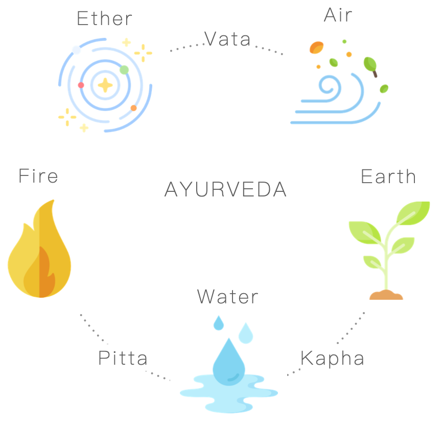

# 阿育吠陀平衡食療
阿育吠陀 आयुर्वेद（Ayurveda）在梵文中意為長生之術或生命知識，從 5000 年前的古印度印度流傳至今。它的理論基礎歷史悠久非常複雜，簡單來說就是一種掌握在自己手中的療程，結合飲食、生活方式、藥草等元素，進行淨化及滋養，改善人的身心靈平衡與健康。

如同傳統中醫，阿育吠陀將生活習慣、身體徵狀、各種食物分門別類，例如辛辣食物或皮疹被歸類為具有燥熱的特性，而小黃瓜或是貧血則是寒冷的。一旦體內出現不平衡，阿育吠陀就會建議使用具有相反特性的食物和行為來恢復平衡，幫助身體減壓、保養免疫和消化系統。而阿育吠陀最好玩的地方，就是你可以依照自己的能量體質進行保養。

在傳統印度觀念裡，宇宙萬物包括人體皆由水、火、土、空、氣五個元素組成，這些元素的屬性組合形成三種能量體質（Dosha）：

- Vata 風：由氣和空組成，用於消耗能量，掌管身心的流動與循環
- Pitta 火：由火和水組成，用於管理能量，掌管消化與代謝
- Kapha 水：由土和水組成，用於儲存能量，掌管骨骼、細胞與肌肉

如果失衡過度偏向其中一方，都可能影響身心靈狀態。例如風型人失衡，變得容易緊張、易衝動，火型人變得容易批判且急躁，水型人變得容易馬乎消極。讓這三種 Dosha 體質維持平衡，就是阿育吠陀想追求的狀態。

這邊提供中英文各一個網站，你可以用簡單的測驗，大致了解自己擁有哪一種能量主導的體質，就可以知道吃什麼、或做什麼能夠幫助自己身心靈更加平衡舒適。

[【英文網站】Kripalu: What’s Your Dosha](https://kripalu.org/content/whats-your-dosha)

[【中文網站】Sense Studio 阿育吠陀體質測驗](https://www.sensestudio.co/healthy-living/ayurveda-doshas-quiz)

當然，各式各樣的食材在阿育吠陀的世界裡也使用 Dosha 分類了，每樣食材各有各對應的特性，也在不同體質的人身上發揮不同的功效。下面的表格整理了這次 Pick Relish 的主題菜「乳酪奶油馬薩拉」所用到的香料介紹，以及它們的阿育吠陀特性。

| 食材               | 說明                                             | 阿育吠陀介紹                                                                              |
| ---------------- | ---------------------------------------------- | ----------------------------------------------------------------------------------- |
| 綠豆蔻 Cardamom     | 高貴的綠豆蔻常被稱為「香料之后」，散著一股甜蜜清新的奇香。具有溫暖和鎮靜的特性。       | 含豐富維生素 C 強化免疫系統，幫助排毒，平衡腸胃和肺的健康環境，改善脹氣和呼吸，幫助舒壓提升睡眠品質。雖然適合任一種能量體質的人食用，不過火型能量過高建議斟酌份量。 |
| 丁香 Clove         | 外型像根釘子，是一種乾燥花苞，香氣濃郁、性溫、味辛，它的溫暖特性可以幫助風型人能量落地扎根。 | 具有防腐劑及殺菌劑的特性，幫助腸胃蠕動和血液循環，促進身體排汗。具有溫和麻醉效果，常被用於緩解牙痛。另外具有催情作用。                         |
| 小茴香籽 Cumin Seeds | 香氣濃郁且特殊，世界各地的料理都愛用，北非、古巴、墨西哥都會使用小茴香籽為菜餚增添迷人滋味。 | 對消化系統特別好，並且去除體內的濕氣，淨化膚質、舒緩緊繃肌肉。幫忙撫平風和水的失衡，強化火的力量。                                   |

