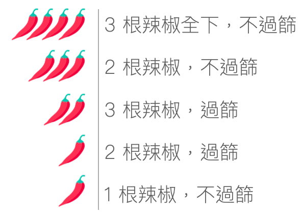

- 建議將食譜整體大致看過再開始
- 香料味道濃，建議將房間門關上，並讓廚房空氣流通，抽油煙機催蕊
- 所有食材份量已按照食譜分配，不需再計量，但仍可依個人喜好調整，咖哩辣度調整，請看辣度表
  
- 香料個別包裝可聞聞看味道，香料包裝分成灰色、黃色兩種膠帶，灰色膠帶分兩階段加入，詳細說明請看食材分組
- 如果有加購印度米，煮米的比例為 1 杯米：1 ½ 杯水
- 我們準備了印度歌單幫助你進入狀況，來來來，[歌單連結請點我](https://www.youtube.com/playlist?list=PLlm-VdSWDpo353wVgfzE02V0GLSPRugRa)
