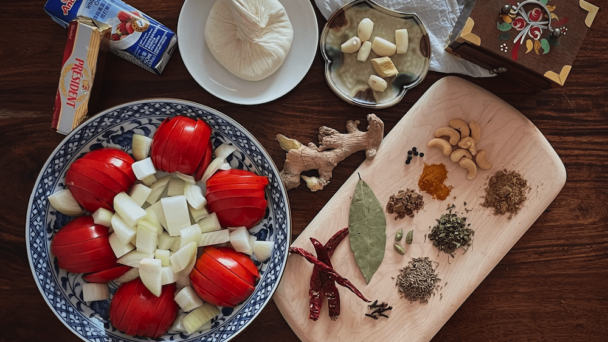

# 乳酪奶油馬薩拉 पनीर बटर मसाला रेसिपी Paneer Butter Masala

濃郁辛香的乳酪奶油馬薩拉，料理方式和材料都是北印度特有的風格，受到旁遮普與阿富汗的影響，一路傳承改良並於 1950 左右成為今天的樣貌，以現在的名稱最初亮相於旁遮普人經營的德里餐廳 Moti Mahal 菜單上。雖然食材眾多，但作法簡單不易失敗，還可以隨著自己的口味變化調整，家家戶戶都適合烹調。
中火炒香各種香料、洋蔥、番茄等蔬菜，機器打勻後過篩，加入煎得金黃的乳酪，起鍋前將鮮奶油像作畫一般勾勒出漂亮弧線，再灑一把新鮮芫荽點綴，好了，我要開動了誰也別攔著。
終於混著米飯吃下第一口，一旁的米先生突然一語不發起立離開座位，走向客廳的空曠處（究竟要幹嘛），我趕緊跟上並戲劇化地抓住他的手臂，才發現他竟然渾身雞皮疙瘩。「太、好、吃、了！這太瘋狂了吧！」

接下來我們倆忍不住手拉手滿屋子轉圈圈，豐富多變的氣味每秒不斷在嘴裡炸出新的層次。一下子太滿足而似乎覺得有點暈（或是因為剛才的轉圈），胃也暖了起來，真是名符其實的 comfort food。新鮮洋蔥甜又嗆，番茄是炯炯有神的酸，還有味道明明柔和，在一群大鳴大放的香料中卻分毫不減存在感的自製乳酪，又嫩又香，整道料理和諧又精彩，我真的會嚇瘋。
