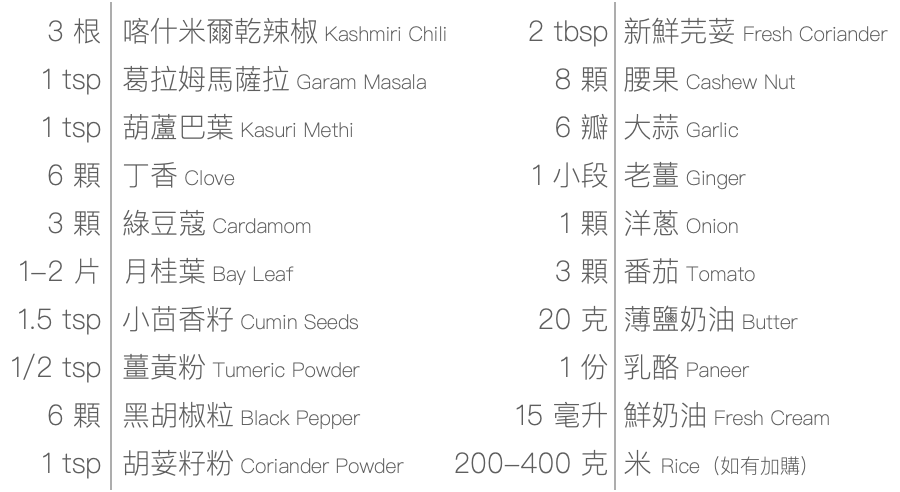

### 關於廚房器具
- 不鏽鋼網篩用於過濾掉香料的渣渣，讓口感和味道都更滑順。請使用 10-16 目的網篩（篩孔尺寸 1.18-2mm），大概是擋得住綠豆但擋不住小米的大小
- 如果沒有網篩或篩孔太細無法使用，在用機器打勻之前，撈出纖維堅硬的食材例如薑、月桂葉等，並建議參考辣度表，先撈出部分辣椒
- 如果沒有食物調理機、調理棒或果汁機，在食材下鍋前，請先將大蒜、薑、洋蔥、番茄、腰果都盡量切碎

## 乳酪奶油馬薩拉 पनीर बटर मसाला रेसिपी Paneer Butter Masala｜What You’ll Need

- 任一種烹調用植物油（如：葵花油、葡萄籽油）
- 調味用鹽
- 白開水
- 一般菜刀
- 深平底鍋（也可以炒鍋或湯鍋替代，不鏽鋼需注意沾鍋）
- 果汁機或食物調理機
- 不鏽鋼網篩（一般孔徑 10-16 目皆可）

## 材料包裡有

- 3 根：喀什米爾乾辣椒 Kashmiri Chili
- 1 tsp：葛拉姆馬薩拉 Garam Masala
- 1 tsp：葫蘆巴葉 Kasuri Methi
- 6 顆：丁香 Clove
- 3 顆：綠豆蔻 Cardamom
- 1-2 片：月桂葉 Bay Leaf
- 1.5 tsp：小茴香籽 Cumin Seeds
- 1/2 tsp：薑黃粉 Tumeric Powder
- 6 顆：黑胡椒粒 Black Pepper
- 1 tsp：胡荽籽粉 Coriander Powder
- 2 tbsp：新鮮芫荽 Fresh Coriander
- 8 顆：腰果 Cashew Nut
- 6 瓣：大蒜 Garlic
- 1 小段：老薑 Ginger
- 1 顆：洋蔥 Onion
- 3 顆：番茄 Tomato
- 20 克：薄鹽奶油 Butter
- 1 份：乳酪 Paneer
- 15 毫升：鮮奶油 Fresh Cream
- 200-400 克：米 Rice（如有加購）
