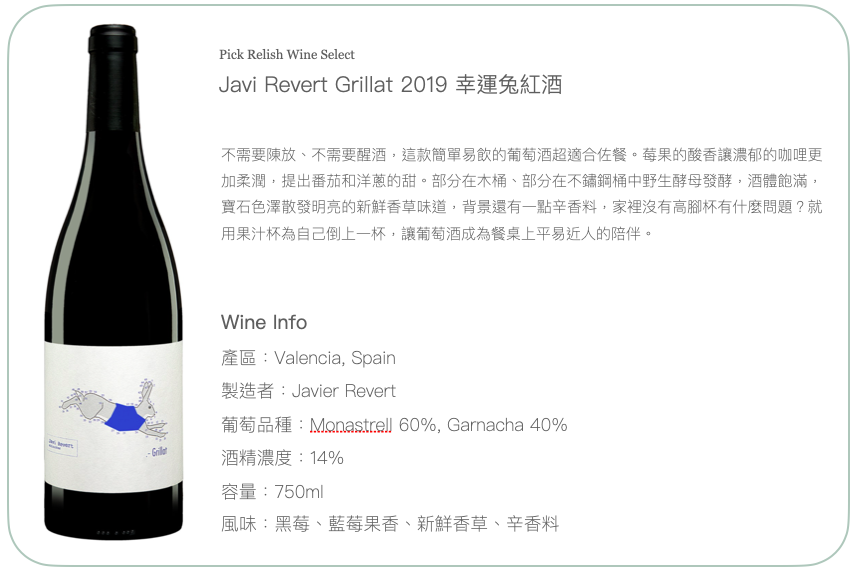

# 好好喝選酒

# Javi Revert Grillat 2019 幸運兔紅酒

不需要陳放、不需要醒酒，這款簡單易飲的葡萄酒超適合佐餐。莓果的酸香讓濃郁的咖哩更加柔潤，提出番茄和洋蔥的甜。部分在木桶、部分在不鏽鋼桶中野生酵母發酵，酒體飽滿，寶石色澤散發明亮的新鮮香草味道，背景還有一點辛香料，家裡沒有高腳杯有什麼問題？就用果汁杯為自己倒上一杯，讓葡萄酒成為餐桌上平易近人的陪伴。

|      |                              |
| ---- | ---------------------------- |
| 產區   | Valencia, Spain              |
| 年份   | 2019              |
| 製造者  | Javier Revert                |
| 葡萄品種 | Monastrell 60%, Garnacha 40% |
| 酒精濃度 | 14%                          |
| 容量   | 750ml                        |
| 風味   | 黑莓、藍莓果香、新鮮香草、辛香料             |

